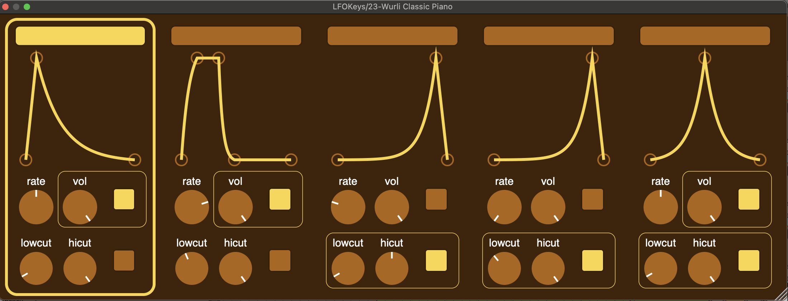

# Overview

LFOKeys is a VST3 plugin  that lets you play and combine different waveforms using your computer keyboard. It’s currently hardwired to the keys A, S, D, F, G to trigger five distinct waveforms. You can click to edit the LFO wave shapes to rhythmically control EQ and volume, with supported LFO rates of 1, 1/2, 1/4, 1/8, and 1/16.

To edit the waveforms, click and drag any of the points. To add a new point double click on a segment. To remove a point double click on a point. To "bend" a line segment press and hold option, then click and drag the line segment

The plugin is built using JUCE. Only supported on Mac.

# Requirements
- CMake 3.15 or higher  
- C++17 compatible compiler (e.g., Clang on macOS)  
- JUCE modules (included as a subdirectory)  

# Build Instructions (macOS)
Open a terminal in the project root and run:  
`mkdir -p build`  
`cd build`   
`cmake -DCMAKE_BUILD_TYPE=Release ..`  
`cmake --build . --config Release`  
The compiled plugin will be located at:  
`build/LFOKeys_artefacts/Release/VST3/LFOKeys.vst3`  
Then copy the .vst3 file to the system or user VST3 plugin folder.

# macOS security and permissions
When opening the plugin in your DAW for the first time:  
1. If macOS blocks the plugin, open System Preferences > Security & Privacy > General, and click Allow Anyway.  
2. If still blocked, remove quarantine attributes:  
xattr -d com.apple.quarantine ~/Library/Audio/Plug-Ins/VST3/LFOKeys.vst3  
3. Rescan the plugins.
# Notes

Feel free to open issues or submit pull requests!  
I used https://github.com/getdunne/juce-MultiStepEnvelopeGenerator for the envelopes.

# Room for improvement

Improve quality of the volume and EQ modulation (currently uses the default JUCE libraries).

Add more rates.

Add option for MIDI input to trigger different waveforms.

Code sign with Apple Developer Account so the plugin works right away.
